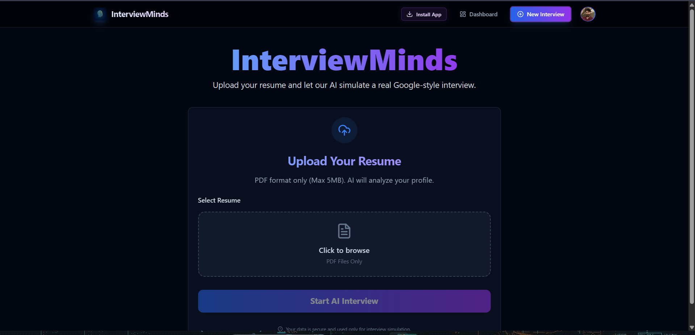

# 🚀 Gautam Kumar — Developer Portfolio

A premium, recruiter-friendly portfolio built with Next.js 16, React 19 & Framer Motion

[](https://gautam-kr.vercel.app/)
[](https://github.com/theunstopabble)
[](https://linkedin.com/in/gautamkr62)

---

## ✨ Features

| Feature                     | Description                                                                              |
| --------------------------- | ---------------------------------------------------------------------------------------- |
| 🎨 Premium Dark UI          | Glassmorphism, gradient accents, and micro-animations for a stunning first impression    |
| 💼 Experience Timeline      | Alternating timeline showcasing 3 production internships with verified certificate links |
| 🛠️ Project Showcase         | 4 featured projects with real screenshots, hover zoom effects, and live demo links       |
| 📊 Skills Grid              | 5 categorized skill groups with animated badges                                          |
| 📱 Fully Responsive         | Optimized for mobile (320px), tablet, and desktop viewports                              |
| ⚡ Static Generation        | Pre-rendered pages for blazing-fast load times and excellent SEO                         |
| 🔗 Certificate Verification | Direct links to verified internship credentials                                          |

---

## 🧰 Tech Stack

| Layer      | Technologies                                      |
| ---------- | ------------------------------------------------- |
| Framework  | Next.js 16 (App Router) · React 19 · TypeScript   |
| Styling    | Tailwind CSS 4 · Shadcn UI · Custom Glassmorphism |
| Animations | Framer Motion · CSS Keyframes                     |
| Icons      | Lucide React                                      |
| Deployment | Vercel (Auto CI/CD from GitHub)                   |

---

## 📸 Preview

### Hero Section



### Featured Projects (with Real Screenshots)

Each project card displays an actual screenshot of the deployed application with a smooth hover-zoom effect.

---

## 🏗️ Project Structure

```text
src/
├── app/
│   ├── globals.css          # Design system & utility classes
│   ├── layout.tsx           # Root layout with SEO metadata
│   └── page.tsx             # Main page (all sections)
├── components/
│   ├── home/
│   │   ├── Hero.tsx         # Animated hero with stats & CTAs
│   │   ├── Experience.tsx   # Timeline with certificate links
│   │   ├── Projects.tsx     # Project grid wrapper
│   │   ├── ProjectCard.tsx  # Card with screenshot & hover zoom
│   │   ├── Skills.tsx       # Categorized skills display
│   │   ├── Education.tsx    # B.Tech details
│   │   ├── About.tsx        # Bio & highlight cards
│   │   ├── Contact.tsx      # Email, phone, social links
│   │   └── Footer.tsx       # Professional footer
│   ├── layout/
│   │   └── Navbar.tsx       # Navigation with resume download
│   └── ui/                  # Shadcn UI components
├── data/
│   └── projects.ts          # Project data with screenshots
├── lib/
│   └── utils.ts             # Utility functions
└── types.ts                 # TypeScript interfaces
```

---

## 🚀 Quick Start

```bash
# Clone the repository
git clone https://github.com/theunstopabble/gautam_portfolio.git
cd gautam_portfolio

# Install dependencies
npm install

# Start development server
npm run dev

# Build for production
npm run build
```

Open [http://localhost:3000](http://localhost:3000) to view it locally.

---

## 📄 Sections

1. **Hero** — Animated gradient name, "Available for Opportunities" badge, social links, stats counters
2. **Experience** — 3 internships (Microsoft Elevate × AICTE, Edunet Foundation × IBM, YHills) with verified certificates
3. **Projects** — InterviewMinds, Satark-AI, TexFolio, SwadKart with live demos & source code
4. **Skills** — Languages, Frontend, Backend, AI/ML, DevOps & Tools
5. **Education** — B.Tech in Computer Science, Jagannath University (2023–2027)
6. **About** — Professional summary with highlight cards
7. **Contact** — Email, phone, and social media links

---

## 🌐 Deployment

This project is deployed on **Vercel** with automatic CI/CD. Every push to the `main` branch triggers a new production build.

Live URL: [https://gautam-kr.vercel.app/](https://gautam-kr.vercel.app/)

---

## 📬 Contact

- **Email:** [gautamkumar43421@gmail.com](mailto:gautamkumar43421@gmail.com)
- **Phone:** +91-6207793196
- **LinkedIn:** [linkedin.com/in/gautamkr62](https://linkedin.com/in/gautamkr62)
- **GitHub:** [github.com/theunstopabble](https://github.com/theunstopabble)

---

## License

Built with ❤️ by Gautam Kumar
